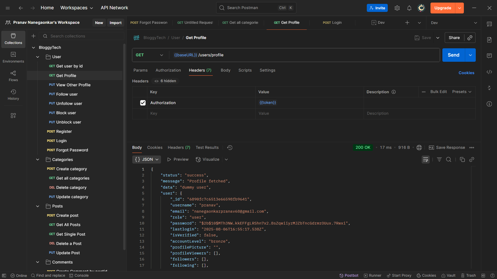

# 📝 BlogyTechApp

🔗 **Project Repository:** [BlogyTechApp](https://github.com/Pranav-Nanegaonkar/BlogyTechApp)

Welcome to **BlogyTechApp** — an **industry-standard**, feature-rich blogging platform backend built with robust and scalable technologies. 🚀  
This project is under active development and aims to power modern content-sharing applications with features found in real-world production apps.

> ⚠️ **Note**: This project is under active development.

---

## ⚙️ Tech Stack

- 🧠 **Node.js** + **Express.js**
- 🗃️ **MongoDB** + **Mongoose**
- 🔐 **JWT** Authentication
- 📧 **Nodemailer** for password recovery
- 🧰 RESTful API architecture

---

## 📦 Models Overview

### 👤 User Model
- Username, email, password (hashed), bio, profile photo
- Followers & following lists
- Account status: Active / Blocked
- Timestamps

### 📝 Post Model
- Title, description, category
- Author reference
- Number of likes & views
- Thumbnail image
- Timestamps

### 💬 Comment Model
- Post reference
- Author reference
- Comment text
- Timestamps

### ❤️ Like Model
- Post reference
- User reference
- Timestamps

### 📂 Category Model
- Name of the category
- Description

---

## 🧠 Core Functionalities

### 🛑 Global Error Handling & Async Handler

- Centralized error handler ensures consistent error responses throughout the API ⚠️
- All routes and controllers use `express-async-handler` to simplify error management in asynchronous functions 🧠
- No more try-catch blocks everywhere — clean and readable codebase ✅

Example:
```js
// asyncHandler in action
const asyncHandler = require("express-async-handler");

const getUserProfile = asyncHandler(async (req, res) => {
  const user = await User.findById(req.user._id);
  if (!user) throw new Error("User not found");
  res.json(user);
});
```


### 🔐 Authentication & Authorization
- Secure JWT-based login and signup
- Admin & user role distinction
- Protected routes with middleware

### 🔄 Follow / Unfollow Users
- Users can follow other users to keep track of their posts 👥
- Automatic updates to followers & following lists

### 🚫 Block / Unblock Users
- Admin can block or unblock users 🔒
- Blocked users can't log in or access the system

### 🧾 Create / Edit / Delete Posts
- Authenticated users can create blog posts 📝
- CRUD operations with full validation

### 💬 Commenting System
- Users can comment on posts
- Edit or delete their own comments

### ❤️ Like / Unlike Posts
- Like toggle system for any post 👍
- Keeps track of total likes per post

### 🧠 View Post Details
- Increment view count every time a post is opened 👁️
- Retrieve detailed info with author & comments

### 📥 Forgot Password Flow
- Send reset link via email 📧
- Secure token-based password reset
- Expiry and one-time usability features

### 🏷️ Category Management
- Admins can add, edit or remove post categories
- Posts are organized by categories for better discoverability

---

## 📌 Project Structure

```
BlogyTechApp/
├── config/           # DB and cloudinary config
├── controllers/      # All business logic
├── middlewares/      # JWT & role protection
├── models/           # Mongoose models
├── routes/           # API route declarations
├── utils/            # Utility functions (e.g., sendEmail)
├── uploads/          # File uploads (if any)
├── .env              # Environment config
└── server.js         # Entry point
```

---

## 🧪 Upcoming Features

- 🔄 Refresh tokens & session management
- 📨 Email verification on signup
- 📊 Admin dashboard with analytics
- 📱 Mobile-first frontend (in separate repo)
- 🌐 Docker & CI/CD integration

---

## 🚀 Getting Started

```bash
git clone https://github.com/Pranav-Nanegaonkar/BlogyTechApp.git
cd BlogyTechApp
npm install
npm run dev
```

Make sure to add your `.env` file with correct MongoDB URI, JWT secret, and SMTP credentials.

---

## 🙌 Contributing

Want to contribute? Feel free to fork the repo and submit a pull request. PRs are always welcome!

---

## 👨‍💻 Author

**Pranav Nanegaonkar**  
🔗 [GitHub](https://github.com/Pranav-Nanegaonkar)

> 🚧 _This project is actively being developed. Stay tuned for more features!_
---

## 🖼️ API Preview (Postman)

Here's a preview of the **Get Profile** API working in Postman with authentication headers and a successful JSON response:


